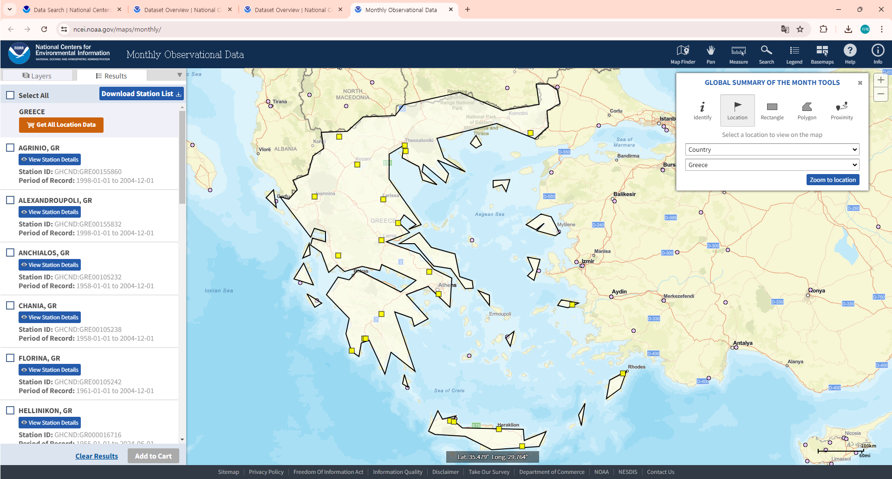

# 파일 수정 사항 정리
- 날짜는 역순으로 정렬

## file tree
- climate 파일
	- climate_data_test.ipynb
		- 자료 정리 및 테스트 코드
        - 연습 및 코드 누적용
	- climate_data_crawling.ipynb
		- API 이용한 자료 다운로드 코드
    - climate_list_download.ipynb
        - 기준 자료 정리 코드
    - climate_data_country.ipynb
        - 국가 코드, 국가명, 파일 이름을 연결
	- rawdata_climate 폴더
		- 원본 자료
		- country-list.txt
			- 국가코드와 국가명
		- filelist.txt
			- 지점코드와 용량
		- 지점코드.txt
			- API로 읽어 저장함
	- document_climate 폴더
		- 참고 자료 정리
			- GSOM_readme.txt
				- 자료 소개서
			- GSOM_documentation.pdf
				- 자료 설명서
			- GSOM_GSOY_Description_Document_v1.0.2_20200219.pdf
				- 연/월 통합 상세 설명서
	- data_climate 폴더
		- 프로젝트에 활용할 정제된 데이터
		- 기준 자료 정리
			- country_list.csv
			- file_list.csv
		- 활용 자료
			- 지점코드.csv
				- 바로 csv로 저장할지 txt를 변환할지 못정함
        - gsom-latest 폴더
            - NCEI 홈페이지에서 직접 받은 csv 파일
            - API 허브에서 받은 것과 동일함
---

## Describtion

### 20240709 2110
- 파이썬 코드 기능 별로 분리함, file tree 참고
- climate_data_country.ipynb
    - file list와 country list를 병합하여 파일의 국가명을 정리함
    - NCEI에서 받은 대용량 파일을 정리함
        - data_climate 폴더의 gsom-latest 폴더 내부에 존재함
    - 직접 받은 파일들과 file list가 동일한지 확인
        - 16개 자료는 파일은 있으나 국가 코드 확인이 안 됨
        - 추후 필요시 수기로 찾아봐야 함
- 데이터 위치 지도로 확인 가능
    - https://www.ncei.noaa.gov/maps/monthly/ 

 

### 20240709 1940
- 개인 고유 인증키, 각자 버전 활용해야 함
    - AUTH = "secrets Leak alerts로 인해 마스킹처리, 코드 run 원할시 기상청 API 허브 가입 후 활용해 주세요."
    
 
 
 
 

### 20240707 0220
- 기상청 API 허브 말고 NCEI 홈페이지를 직접 이용하는 방법이 있어 Bulk 버전 파일을 따로 다운받고 있음
	- 링크: https://www.ncei.noaa.gov/access/search/data-search/global-summary-of-the-month
	- Global Summary of the Month (GSOM), Version 1
	- File Count/Limit: 10000/1000   Total File Count: 122041
- 지점 코드를 활용해 API 호출하고 바로 csv로 저장하여 df로 불러오는 것까지 수행
	- globals() 함수 활용
	- 랜덤으로 열어본 파일에서 날짜 결측치와, 주요 변수 결측치가 존재하는 것을 확인함
	- 호출 횟수나 용량은 데이터를 살펴보는 데에는 문제 없을 것으로 보임, 정해지고 나서는 날짜를 나눠서 데이터를 받으면 될 것으로 보임
- 지점 코드를 해석하는 방법에 대해 고민이 있음.
	- 앞의 두 글자는 국가, 중간에 문자 하나가 더 있을 경우 망, 뒤에 지점번호는 9글자라고 나와있지만 실제로는 8글자인 경우가 많음. 무슨 일인지 질문해야 함
	- feature 요소
		- "STATION","DATE","LATITUDE","LONGITUDE","ELEVATION","NAME","CDSD","CDSD_ATTRIBUTES","CLDD","CLDD_ATTRIBUTES","DP01","DP01_ATTRIBUTES","DP10","DP10_ATTRIBUTES","DP1X","DP1X_ATTRIBUTES","DT00","DT00_ATTRIBUTES","DT32","DT32_ATTRIBUTES","DX32","DX32_ATTRIBUTES","DX70","DX70_ATTRIBUTES","DX90","DX90_ATTRIBUTES","DYNT","DYNT_ATTRIBUTES","DYXP","DYXP_ATTRIBUTES","DYXT","DYXT_ATTRIBUTES","EMNT","EMNT_ATTRIBUTES","EMXP","EMXP_ATTRIBUTES","EMXT","EMXT_ATTRIBUTES","HDSD","HDSD_ATTRIBUTES","HTDD","HTDD_ATTRIBUTES","PRCP","PRCP_ATTRIBUTES","TAVG","TAVG_ATTRIBUTES","TMAX","TMAX_ATTRIBUTES","TMIN","TMIN_ATTRIBUTES"
	- 값에 ,가 존재하는 경우 어떻게 해석해야하 할지 모르겠음..
- 만약에 GTS로 갈아탄다고 하면 너무 울것 같음.
	- 내일은 GTS에 결측치가 어떻게 나오는지 확인해야겠음
	- 데이터 정합성이 더 좋다면 갈아타야할 수도 있음..
	- GTS의 일일 데이터를 월 통계로 변환하는 작업이 필요할지도 모르겠음
#### 다음 할 일
- GTS 활용법 확인
	- GTS 자료와 NCEI 자료 비교 가능하다면 확인 필요
- txt로 저장 후 csv 변환과 csv로 바로 저장한 버전에 자료 손실 등으로 인한 차이가 있는지 확인하기
- NCEI 지점코드 해석법 필요함
- NCEI 자료와 국가 코드를 연결하여 컬럼을 하나 추가해야 함
#### 새롭게 발견한 사실
- csv 파일 전체 다운받음
	- gsom-latest.tar.gz
	- 1.5기가이지만, tar까지 풀면 9기가 넘음

 
 
 
 

### 20240706 0200
- 기상청 API 허브 내에서 세계기상 월별 평균 자료를 활용할 것이므로 NCEI 관측. 통계 자료를 활용함
	- GTS는 XML, JSON 파일로 얻을 수 있기 때문에 추후에 변경 시 많은 노력이 필요할 것
- 기준 데이터 정리가 중요했음
	- 국가명이 나와있는 국가 코드
	- 신청 요인 중 stn값으로 들어가는 지점 코드
- 이후 유럽 혹은 전세계를 활용할 지에 따라 국가 코드 선별작업이 들어갈 것
	- 유럽만 활용한다면 유럽 국가명 정리한 파일을 추가하여 stnNm 리스트 값을 추린 stnNmEU 리스트를 만들것
- 시기도 마찬가지임, 구멍난 데이터가 어디일지 확인하기에 너무 양이 많으므로 우선적으로 활용 지역을 알아야 함
- 데이터를 불러와 저장하고 다시 불러서 DF 정리한 뒤 csv로 저장하는 과정이 너무 쓸데없이 복잡함.
	- 우선 시간 절약을 위해 홈페이지에 나와있는 python 코드를 참고하기만 함
	- 이후 코드를 간결하게 고치는 과정이 필요함
	- 지점코드만 변화하고 나머지는 그대로일 것이므로 함수를 만드는 것도 필요함
	- 시기가 달라질 수도 있으므로 그것 또한 고려해야 함